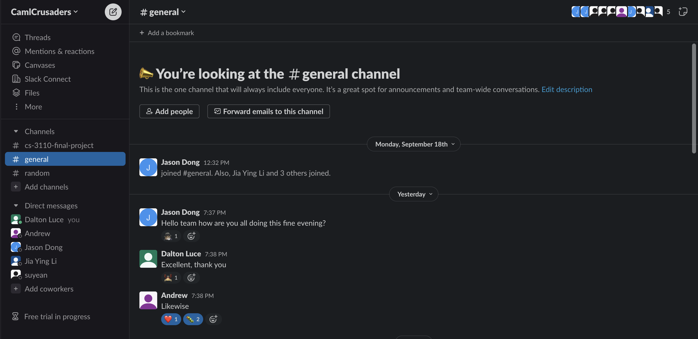
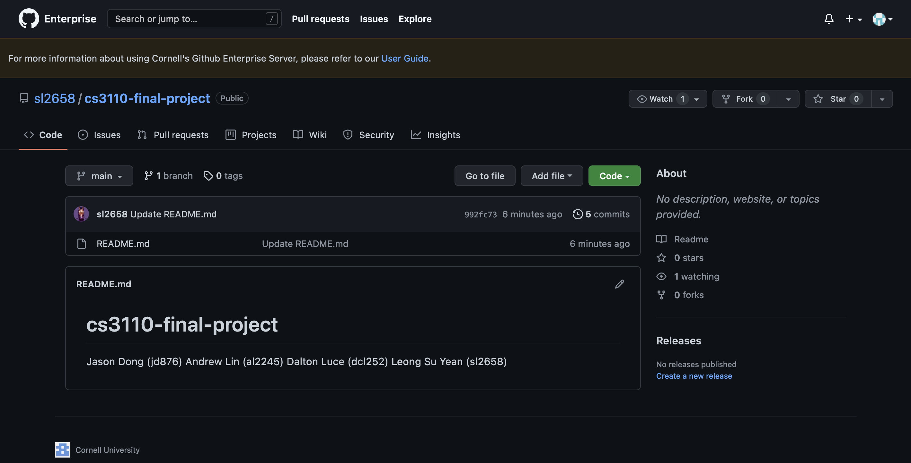

# CamlCrusaders Contract

## Team Name

CamlCrusaders

## Members

| Name          | NetID  |
| ------------- | ------ |
| Andrew Lin    | al2245 |
| Jason Dong    | jd876  |
| Dalton Luce   | dcl252 |
| Su Yean Leong | sl2658 |

## Project Manager

JiaYing Li (jl2725)

## Project Grader

JiaYing Li (jl2725)

## Meeting Time

Saturday 1:30 pm - 2:00 pm (tentative)

## Communication Platform

[Slack](https://camlcrusaders.slack.com/archives/C05SMF2SM38)

## [GitHub Repository](https://github.coecis.cornell.edu/sl2658/cs3110-final-project)

## Pitches

### Meal Prep Calculator

This project will track the ingredients stored in the user’s pantry, fridge,
etc, and will recommend recipes that only use ingredients possessed by the user
(essentially a bipartite graph perfect-matching problem).  If this is not
possible, we will design an algorithm to minimize the cost of additional
'ingredients. The program will also take into account the user’s likes/dislikes
to recommend certain recipes the user is more likely to enjoy. We could also
take into account other variables, such as the difficulty of recipes and
tracking the expiration date of ingredients to use older ingredients first.

### Boolean Logic Circuit Builder

This project will build circuits out of a boolean algebra expression using a
terminal library, letting users visualize the flow of logic through the
expression. It will also implement boolean algebra theorems to determine the
minimal form of the boolean expression (implementing the expression with as few
literals and product terms as possible). We could also implement a Karnaugh map
visualizer, which will allow users to view all prime implicants on the map.

### Stock Market Trading Simulator

The project would consist of creating a simulated trading environment where a
user can buy/sell stocks at their current market prices. We can either
generate/input simulated or historical data or use an API to fetch real data.
The application would be able to display stocks with their current price (and
historical data, percent change, etc.) and allow a user to buy/sell these
securities and update user portfolios after such transactions. To expand the
application, we could implement additional order types and provide the user more
data about their portfolio and transaction history. We could also try to
implement algorithms to give trading advice or execute trades to maximize
profits.

## Team Contract

1. To what goals do we all commit?

    Communicate, hold yourself accountable, successfully complete our project,
    learn as a group

2. What are our "ground rules"? Don’t make an exhaustive list; stick with just a
   few.

    Communicate, hold yourself and each other accountable.

3. How frequently will we communicate? How quickly are responses expected?

    Communicate as often as necessary. Responses are expected within 1 day.

4. Where and how frequently will we meet? When is a person considered late to a
   meeting?

    Evenings, weekly if necessary. We will try to meet in person if possible,
    zoom if otherwise. A person is considered late if they miss over half the
    meeting.

5. What team roles will we create? What are the responsibilities of each role?
   Will roles shift around, and if so, how often?

    Primary communicator with PM. We will try to all assume and assist each
    other in these processes and roles to try and gain a multitude of
    experience.

6. How will we hold ourselves and one another accountable? What exactly will we
   say to a team member who appears not to be contributing equally? Or to a
   team member who fails to deliver what was promised?

    We will set goals and deadlines. We will ask said team members about the
    contribution or why they were unable to deliver what was promised and
    discuss how to avoid this situation in the future.

7. How will we make decisions as a team? What exactly will we do when we
   disagree or discover conflict? What will you use as a respectful
   conversation starter?

    We will have open discussion to make important decisions or when we disagree
    or discover conflict. “Can you help me understand why…”

8. What are our procedures for re-visiting this contract?

    We will revisit this contract if necessary if we run into issues during the
    project

9. How will we make this experience fun?

    We will make this experience fun by choosing projects and work we are
    interested in and prioritizing learning and fun throughout the process.
