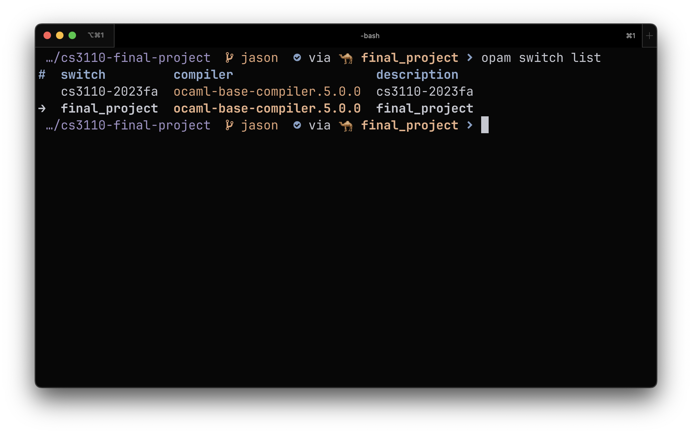

# CS3110 Final Project

| Name          | NetID  |
| ------------- | ------ |
| Andrew Lin    | al2245 |
| Jason Dong    | jd876  |
| Dalton Luce   | dcl252 |
| Su Yean Leong | sl2658 |

## Environment

1. Create a new switch named "final_project"

    ```text
    opam switch create final_project 5.0.0
    ```

2. Install our required packages

    ```text
    opam install -y utop odoc ounit2 qcheck bisect_ppx menhir ocaml-lsp-server ocamlformat ocamlformat-rpc yojson bogue
    ```

3. Ensure you are on the correct switch

    ```text
    opam switch list
    ```

    It should look something like:

    

## [Team Contract](/CONTRACT.md)

## [Roadmap](/ROADMAP.md)

## [Trello](https://trello.com/b/iJHJ0XU2/yummy-ms2)
